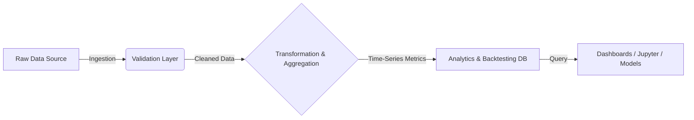

# Stock Market ETL & Analytics Platform


**Built automated ETL pipelines to ingest, validate, and aggregate real-time stock market data, producing analytics-ready time-series datasets. Implemented data quality checks and aggregation workflows to detect anomalies, volatility regimes, and temporal patterns, enabling historical backtesting and signal-driven analytics.**

---

## 📖 Project Overview

This project is an end-to-end analytics platform designed to ingest, validate, transform, and analyze real-time stock market data. The system focuses on building reliable, analytics-ready time-series datasets that can be used for downstream analysis, signal generation, and historical backtesting.

Unlike simple data ingestion scripts, this platform emphasizes **correctness**, **data quality**, and **analytics engineering principles**, ensuring that the data stored is trustworthy for financial modeling.

## 🎯 Core Objectives

- **Automated ETL Pipelines**: Build robust pipelines for real-time market data ingestion.
- **Data Quality Assurance**: Enforce strict validation checks for correctness, consistency, and completeness.
- **Analytics-Ready Data**: Generate high-quality time-series features suitable for modeling.
- **Backtesting Support**: Enable historical analysis, trend detection, and strategy evaluation.

## 🚀 Key Features

### 🔄 Automated ETL Pipelines
- Ingests raw stock market data from API sources.
- Applies transformation logic to normalize and structure data.
- Handles retries and failures gracefully.

### ✅ Data Quality & Validation
- **Schema Validation**: Ensures incoming data matches expected formats.
- **Anomaly Detection**: Identifies missing values, outliers, and inconsistent records *before* aggregation.
- **Null Handling**: Smart imputation or flagging of gaps in market data.

### 📈 Time-Series Aggregations
- Generates windowed metrics including:
  - **Returns**: Daily/Hourly percentage changes.
  - **Rolling Averages**: SMA/EMA for trend identification.
  - **Volatility Indicators**: Standard deviation and variance analysis.

### 🧠 Anomaly & Regime Detection
- Identifies unusual price movements and volatility shifts.
- Detects temporal patterns useful for signal-driven analysis.

### ⏪ Historical Backtesting Support
- Curates clean, versioned datasets for retrospective analysis.
- Optimizes storage for efficient time-range querying.

## 🛠️ Tech Stack

- **Languages**: Python, SQL
- **Data Processing**: Pandas, NumPy (for vectorization), SQLAlchemy
- **Analytics**: Time-Series Analysis, Rolling Window Operations
- **Database**: PostgreSQL (or specialized Time-Series DB)
- **Workflow**: Automated Scripts / Airflow (Conceptual)

## 🏗️ Architecture (High Level)



**Flow:** `Data Ingestion` → `Validation & Quality Checks` → `Time-Series Aggregation` → `Analytics-Ready Storage` → `Analysis / Backtesting`

## 💡 Why This Project Matters

This project demonstrates practical experience with **analytics engineering principles**, including:
- **ETL Design**: Moving beyond simple scripts to robust pipelines.
- **Data Modeling**: Designing schemas optimized for time-series workloads.
- **Data Quality**: enforcing strict checks to prevent "garbage in, garbage out".
- **Downstream Usability**: Preparing datasets that are immediately useful for analysts and data scientists.

It emphasizes the **reliability** and **usability** of data rather than just raw volume.

## 📦 Getting Started

### Prerequisites
- Python 3.9+
- PostgreSQL (or equivalent SQL database)
- pip

### Installation

1. **Clone the repository**
   ```bash
   git clone https://github.com/ShachiMistry/Stock-Market-ETL-Analytics-Platform.git
   cd Stock-Market-ETL-Analytics-Platform
   ```

2. **Set up a Virtual Environment**
   ```bash
   python -m venv venv
   source venv/bin/activate  # On Windows: venv\Scripts\activate
   ```

3. **Install Dependencies**
   ```bash
   pip install -r requirements.txt
   ```

4. **Configuration**
   - Create a `.env` file based on `.env.example`.
   - Add your Database credentials and API keys.

5. **Run the ETL Pipeline**
   ```bash
   python src/main.py
   ```

## 👨‍💻 What This Project Demonstrates (For Recruiters)
- **Building production-style ETL pipelines**
- **Applying data quality checks in analytics workflows**
- **Working with time-series data at scale**
- **Designing datasets for analytics, modeling, and decision making**

